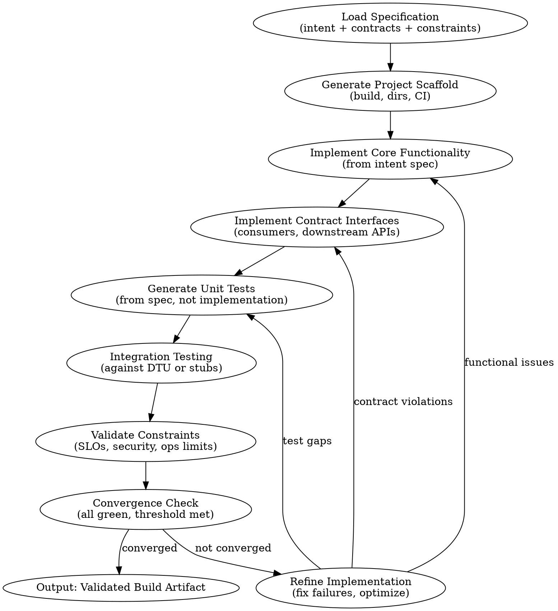

# The Software Factory: A Practitioner's Guide to Specification-Driven Development for Enterprise Services

**A reference for implementing factory-pattern development within an enterprise SOA.**

**Version: 1**

[https://www.thewoolleyweb.com/software-factory-practitioners-guide-v01.pdf](https://www.thewoolleyweb.com/software-factory-practitioners-guide-v01.pdf)

[https://github.com/thewoolleyman/software-factory-practitioners-guide/blob/main/software-factory-practitioners-guide-v01.md](https://github.com/thewoolleyman/software-factory-practitioners-guide/blob/main/software-factory-practitioners-guide-v01.md)

**Chad Woolley, thewoolleyman@gmail.com, February 2026**

---

## Table of Contents

- [Executive Summary](#executive-summary)
- [1. Overview and Scope](#1-overview-and-scope)
  - [Reality Check: This is an Aspirational Guide](#reality-check-this-is-an-aspirational-guide)
- [2. Repository Layout](#2-repository-layout)
  - [Example Layout](#example-layout)
  - [Adapting the Layout](#adapting-the-layout)
- [3. The Specification Layer](#3-the-specification-layer)
  - [Intent Specifications (NLSpec)](#intent-specifications-nlspec)
  - [Contracts](#contracts)
  - [Constraints](#constraints)
- [4. Scenarios as Holdout Validation](#4-scenarios-as-holdout-validation)
  - [The Holdout Set Analogy](#the-holdout-set-analogy)
  - [What Makes a Good Scenario](#what-makes-a-good-scenario)
  - [Storing and Managing Holdout Scenarios](#storing-and-managing-holdout-scenarios)
  - [The Scenario Authoring Problem](#the-scenario-authoring-problem)
- [5. The Factory Development Loop](#5-the-factory-development-loop)
  - [The Attractor Pattern](#the-attractor-pattern)
  - [Provider-Aligned Agent Execution](#provider-aligned-agent-execution)
  - [Convergence and the Digital Twin Universe](#convergence-and-the-digital-twin-universe)
  - [The Satisfaction Metric](#the-satisfaction-metric)
- [6. Production Observability and Specification Evolution](#6-production-observability-and-specification-evolution)
  - [Three Categories of Production Signal](#three-categories-of-production-signal)
  - [The Current State of Production -> Specification Feedback](#the-current-state-of-production---specification-feedback)
  - [What a Production Feedback Loop Could Look Like](#what-a-production-feedback-loop-could-look-like)
- [7. The Interactive/Non-Interactive Boundary](#7-the-interactivenon-interactive-boundary)
  - [StrongDM's Shift Work Pattern](#strongdms-shift-work-pattern)
  - [When Is the Specification Complete?](#when-is-the-specification-complete)
  - [The Separate Agent Sets Architecture](#the-separate-agent-sets-architecture)
  - [Industry Landscape](#industry-landscape)
- [8. Evolving Specifications Over Time](#8-evolving-specifications-over-time)
  - [Specification Versioning](#specification-versioning)
  - [Patterns from Existing Systems](#patterns-from-existing-systems)
  - [The Spec Amendment Workflow](#the-spec-amendment-workflow)
- [9. SOA Boundary Coordination](#9-soa-boundary-coordination)
  - [The Coordination Problem](#the-coordination-problem)
  - [Out of Scope](#out-of-scope)
- [10. Applicability Beyond SOA](#10-applicability-beyond-soa)
- [11. Toolchain Summary](#11-toolchain-summary)
  - [Specification Authoring](#specification-authoring)
  - [Factory Orchestration](#factory-orchestration)
  - [Context and State](#context-and-state)
  - [Agent Identity](#agent-identity)
  - [Skills and Capabilities](#skills-and-capabilities)
  - [Agentic TUI](#agentic-tui)
- [12. Getting Started](#12-getting-started)
  - [Start experimenting](#start-experimenting)
  - [Let your agents read this guide](#let-your-agents-read-this-guide)
  - [Notes on usage of Kilroy](#notes-on-usage-of-kilroy)
- [13. Out of Scope](#13-out-of-scope)
- [14. Open Questions](#14-open-questions)
  - [Specification Completeness and Validation](#specification-completeness-and-validation)
  - [Production Signals and Specification Evolution](#production-signals-and-specification-evolution)
  - [Scaling and Complexity](#scaling-and-complexity)
  - [Enterprise Integration and Auditability](#enterprise-integration-and-auditability)
  - [Generated Code as Artifact](#generated-code-as-artifact)
- [15. Closing Perspective](#15-closing-perspective)
  - [What's next?](#whats-next)
- [References and Further Reading](#references-and-further-reading)
- [Appendix: A Personal Note](#appendix-a-personal-note)

## Executive Summary

The software factory pattern represents a fundamental shift in how software is built: humans write specifications, coding agents produce the implementation, and a separate validation process verifies correctness — without human code review. In Dan Shapiro's five-level taxonomy [[2](#ref-2)], this is the Level 4-to-5 transition — from human-as-engineering-manager to "dark factory." This guide describes the emerging mechanics for implementing that pattern within an enterprise service-oriented architecture — what is known, what is working, and what remains unsolved.

**The core idea.** The repository encodes a fundamental divide between what humans manage and what machines produce. A "context/intent engineer" manages the human side: specifications (intent describing what the software should do and why, contracts defining exact API boundaries with neighboring services, constraints establishing non-negotiable invariants), holdout scenarios for validation, factory orchestration configuration, and documentation. The machine side is code generated by agents — checked into version control for auditability, but treated as opaque output whose correctness is verified exclusively through externally observable behavior. The human's intellectual contribution is entirely upstream of implementation.

**The key innovation: holdout scenario validation.** Borrowed from machine learning practice, scenarios used to evaluate the software are kept hidden from the agents that build it. This prevents reward-hacking — agents optimizing for tests rather than genuine correctness. Separate agent sets enforce this: spec-refinement agents help humans write specifications and scenarios but never see the code; factory agents implement the code but never see the scenarios; validation agents evaluate the built software but see neither source code nor specifications.

**The factory loop.** The Attractor pattern [[9](#ref-9)], pioneered by StrongDM [[1](#ref-1)], orchestrates coding agents through a graph-structured pipeline of implementation, testing, and refinement phases until the software converges on a validated state. The graph is expressed in DOT format, with each phase governed by targeted prompts and each transition evaluated by the LLM. Different models can be used for different phases — reasoning-heavy models for architecture, fast models for boilerplate.

**Two shifts of work.** The interactive shift is where humans and agents collaborate on specifications, identify gaps, and author scenarios. The non-interactive shift is where the factory runs autonomously — potentially for hours — producing software without human involvement. StrongDM calls this "shift work" [[1](#ref-1)]. The boundary between these shifts is the central design decision: determining when a specification is complete enough for autonomous execution.

**What remains unsolved.** Production observability feeding back into specification evolution is the largest open problem — no existing system fully closes this loop. Enterprise governance [[16](#ref-16)], code provenance, cross-service contract propagation, organizational transformation, and cost management are all critical concerns acknowledged but intentionally scoped out.

**This is an aspirational guide.** StrongDM [[1](#ref-1)] has demonstrated the pattern at a startup with a greenfield codebase. No large enterprise has publicly implemented it at scale. **_The author has not yet produced usable software with this approach — early experiments have mainly revealed how hard it is to define specifications with machine-executable rigor_**. The guide describes what is becoming possible, grounded in published experience from StrongDM, 8090 [[3](#ref-3)], Superpowers [[4](#ref-4)], GitHub's Spec Kit [[5](#ref-5)], and the author's own factory experiments using a forked implementation of Kilroy [[15](#ref-15)] (a Go-based Attractor implementation). It is versioned because we are all still learning.

---

## 1. Overview and Scope

You have a greenfield service to build within an existing enterprise service-oriented architecture, and you want to build it using the software factory pattern — where human-authored specifications drive coding agents that produce, test, and converge working software without human code review.

The factory pattern has moved from theoretical to operational. StrongDM's AI team [[1](#ref-1)] published the first detailed public account of a production software factory in February 2026. A three-person team produced security infrastructure — access management software controlling permissions across Okta, Jira, Slack, and Google Workspace — under two foundational rules: no human writes code, and no human reviews code. The humans design specifications, curate validation scenarios, and monitor satisfaction scores. The agents do everything else.

Dan Shapiro's five-level taxonomy of AI-assisted programming [[2](#ref-2)], published in January 2026, provides useful positioning. Most development teams today operate at Level 2 (pair programming with AI) or Level 3 (human as full-time code reviewer). Level 4 shifts the human role to engineering management — writing specs, crafting agent skills, reviewing plans, then stepping away while agents execute. Level 5, the "dark factory," removes human review entirely.

This guide targets the Level 4-to-5 transition for a single service. It does not describe how an entire organization should restructure, nor does it prescribe governance, compliance, or audit frameworks. Those concerns matter enormously for enterprise adoption, but they are separable from the core mechanics of turning human intent into working, deployed software.

**Prerequisites assumed by this guide:**

The reader's organization already operates an SOA with defined service boundaries, API contracts, and deployment infrastructure. The new service has a clear domain bounded by contracts with neighboring services. The team has access to frontier-class language models (Claude Opus/Sonnet, GPT-5.x, or equivalent) and is willing to invest meaningfully in token spend — StrongDM's benchmark of $1,000/day per human engineer is aggressive, but directionally correct for Level 5 operation. At least one engineer with deep domain expertise will serve as the specification author and factory operator.

**What this guide covers:**

The repository structure that separates human-authored specification from machine-generated implementation. The specification layer — how to express intent, contracts, and constraints in a form agents can execute against. Scenarios as holdout validation — the mechanism that prevents agents from reward-hacking their own tests. The factory development loop — how the Attractor pattern uses DOT-based phase graphs to orchestrate convergence. Production observability and its largely unsolved relationship to specification evolution. The interactive/non-interactive boundary — when human collaboration gives way to autonomous execution. Patterns for evolving specifications over time, drawn from StrongDM, 8090 [[3](#ref-3)], Superpowers [[4](#ref-4)], and GitHub's Spec Kit [[5](#ref-5)].

### Reality Check: This is an Aspirational Guide

This guide describes what is becoming possible, not what most people are doing right now. StrongDM has demonstrated the approach at a startup with a greenfield codebase and no customers yet. Other small and mid-size companies are beginning to explore similar patterns. But as of this writing, to the author's knowledge, no large enterprise has publicly shared an implementation of factory-pattern development at scale. Sections [13](#13-out-of-scope) and [14](#14-open-questions) list many large, critical barriers — established SDLC processes, customers with SLAs, and significant legal and contractual commitments among them.

The author's own early factory experiments have confirmed that this is genuinely _HARD_. To be transparent: **_I have not yet produced usable software with the Software Factory approach, even of alpha quality._** After a week or two of hands-on experimentation, the main lessons have been about what _doesn't_ work — specifically, that you cannot take shortcuts by relying too heavily on AI to generate the specification. The difficulties are real:

- Defining specifications with machine-executable rigor, when you can't rely on an experienced domain-aware human to "know what you really mean."
- Creating the pipeline itself, with all of the quality gates you would expect for a development and CI environment, but turned up to 11 and able to run in an automated feedback loop.
- Defining validation harnesses and holdout scenarios with the rigor to enforce an acceptable level of quality.

You have to be deeply involved in creating the specification, understand it thoroughly, and fully grasp how it drives factory operation. This takes significant time and experience.

This guide is a starting milepost — one practitioner's attempt to share what he has learned early in the journey, for the benefit of others. It carries a version designation because it will evolve as the community's collective understanding deepens. We are all learning together how these ideas can and should work in practice.

---

## 2. Repository Layout
### Example Layout

The repository structure encodes a fundamental distinction: what humans manage (often with AI assistance) versus what machines produce autonomously. Everything under `spec/`, `holdout-scenarios/`, `factory/`, and `docs/` is human-managed — authored or curated by the context/intent engineer, possibly with agent assistance during interactive sessions. Everything under `src/` is machine-generated, version-controlled, but treated as opaque output whose correctness is verified exclusively through externally observable behavior.

```
example-service/
├── spec/
│   ├── intent/
│   ├── contracts/
│   └── constraints/
├── holdout-scenarios/
├── factory/
│   ├── example-service.dot
│   └── attractor-config/
├── src/
└── docs/
```

**`spec/intent/`** — **Intent.** The heart of the factory's input. The name "intent" was chosen deliberately over "requirements" or "features" because it aligns with the factory philosophy: humans express what the software should accomplish and why, not how. The intent directory contains natural-language specifications (NLSpec, borrowing StrongDM's terminology) that describe the service's purpose, domain model, behavioral narratives, and key architectural decisions. These are the "seed" in StrongDM's Seed -> Validation -> Feedback loop.

**`spec/contracts/`** — **Contracts.** Defines the service's boundaries within the SOA. For a greenfield service, these contracts are the most constrained part of the specification — they must align precisely with the APIs of neighboring services. Upstream contracts describe what this service can expect from services it consumes. Downstream contracts define the APIs this service exposes. These are not aspirational; they are hard interfaces that the factory must implement exactly.

**`spec/constraints/`** — **Constraints.** Holds what GitHub's Spec Kit [[5](#ref-5)] calls the "constitution" — immutable principles that apply to every change. SLO targets, security requirements, and operational constraints live here. Unlike intent, which evolves as understanding deepens, constraints tend to be stable and non-negotiable. An SLO of p99 latency under 200ms is not a suggestion the agent can reinterpret; it is a hard boundary.

**`holdout-scenarios/`** — **Validation.** Stored outside the main codebase accessible to factory agents. The separation mechanism can be sparse checkout rules, a separate repository with restricted access, or an external system. The critical property: factory agents during implementation never see these scenarios. They function as a holdout set in the machine learning sense, preventing agents from overfitting their implementation to the test data. More on this in [Section 4](#4-scenarios-as-holdout-validation).

**`factory/`** — **Orchestration.** Contains the Attractor phase graph (a DOT file defining the generative SDLC) and its configuration. The phase graph is the factory's "program" — it defines what phases the coding agents traverse, what prompts govern each phase, and what convergence criteria determine when the software is ready. Human-authored, version-controlled.

**`src/`** — **Output.** Contains machine-generated code. `src` is a placeholder name — it represents any artifacts generated by the factory, including tests, configuration, and infrastructure-as-code. It is checked into version control. Sandgarden [[6](#ref-6)] takes the opposite approach, treating source code as generated output that is never checked in. This guide treats Sandgarden's no-check-in model as a non-goal: for enterprise systems, checked-in code provides auditability, rollback capability, and integration with existing CI/CD pipelines. The code is what StrongDM calls "opaque weights whose correctness is inferred exclusively from externally observable behavior." You version it for operational reasons, not because humans will read it for comprehension.

**`docs/`** — **Documentation.** Represents human-facing content — developer documentation on the codebase or factory operation. There may be other human-facing content in the repo, depending on the project. Some will be human-authored, some agent-generated, some mixed.

### Adapting the Layout

The example layout above is illustrative, not prescriptive. The actual structure of your specification, holdout scenarios, and supporting context will vary across projects, teams, and planning processes. A team building a data pipeline may organize intent around transformation stages rather than user journeys. A team with an existing test harness may store holdout scenarios in a separate repository rather than a sibling directory.

What the layout does express is the fundamental divide at the heart of the factory pattern: work that humans manage (often with AI assistance) versus work that machines perform autonomously. StrongDM calls this "shift work" (explored in detail in [Section 7](#7-the-interactivenon-interactive-boundary)) — the interactive shift where humans and agents collaborate on specification and scenarios, and the non-interactive shift where the factory generates code without human involvement. The directories above fall on one side or the other. `spec/`, `holdout-scenarios/`, `factory/`, and `docs/` are all human-managed outputs of the interactive shift. `src/` is the output of the non-interactive shift. `factory/` bridges the two — human-authored, but it defines how the non-interactive shift runs. The example layout was chosen to make this divide concrete so that the rest of this guide can reference it clearly.

**A note on the single human role.** In this model, there is one human function: the context/intent engineer. This person (or small team) authors specifications, writes scenarios, configures the factory, and monitors production signals. They do not write code. They do not review code. Their intellectual contribution is upstream of implementation — defining what should exist and how to verify it exists correctly.

---

## 3. The Specification Layer

The specification layer is the factory's primary input and the human's primary artifact. Getting specifications right is where the hard intellectual work lives. As GitHub's Spec Kit documentation puts it: "The lingua franca of development moves to a higher level, and code is the last-mile approach."

### Intent Specifications (NLSpec)

StrongDM coined the term NLSpec — natural-language specification — to describe the markdown documents that seed their factory. An NLSpec is not a traditional requirements document, a user story, or a PRD, though it shares DNA with all three. It is precise enough that a coding agent can implement against it, yet written in natural language that a domain expert can author and review without programming knowledge.

An effective intent specification answers three questions for every significant behavior: what should happen, under what conditions, and why this matters to the user. The "why" is not decoration — it gives the agent context for making reasonable decisions when the specification is silent on edge cases. Compare: "users must authenticate before accessing resources" versus "users must authenticate before accessing resources because this service manages sensitive permission data, and unauthenticated access would violate our security model's zero-trust boundary." The second version helps an agent infer that, when encountering an ambiguous case, it should fail closed rather than open.

The intent directory is organized around behavioral narratives rather than technical components. User journeys describe end-to-end flows from the perspective of the service's consumers (which, in an SOA, may be other services rather than humans). Decision records capture significant architectural choices and their rationale, giving agents context for why the system is shaped a particular way.

### Contracts

For a service within an SOA, contracts are the hardest constraint. They are the exact interfaces that neighboring services already implement or expect. A contract specification includes the API schema (OpenAPI, protobuf, GraphQL, or equivalent), expected request/response patterns, error handling conventions, authentication mechanisms, and rate limiting behavior.

Contracts are bidirectional. Upstream contracts describe what this service can rely on from services it consumes — their APIs, their SLAs, their failure modes. Downstream contracts define what this service promises to its consumers. The factory must produce an implementation that satisfies all downstream contracts while correctly consuming all upstream contracts.

In an enterprise SOA, contract specifications often already exist — API documentation, interface definition files, or integration test suites. The specification engineer's job is to capture these in `spec/contracts/` in a form the factory agents can consume. This may involve translating existing OpenAPI specs into annotated NLSpec that adds behavioral context beyond the schema definition.

### Constraints

Constraints are the non-negotiable invariants that the factory must satisfy regardless of implementation approach. They include service-level objectives (latency percentiles, error budgets, throughput targets), security requirements (authentication mechanisms, data encryption standards, authorization models), and operational constraints (memory limits, CPU budgets, deployment topology requirements).

Constraints function as the "constitution" — immutable, applied to every change. The factory's validation harness checks generated code against constraints continuously, not just at the end of a development cycle.

A well-written constraint is measurable. "The service should be fast" is not a constraint. "P99 response latency must remain below 200ms for the /permissions endpoint under sustained load of 1,000 requests per second" is.

---

## 4. Scenarios as Holdout Validation

The scenario holdout mechanism is the most important innovation in the factory pattern, and it emerged from a painful discovery. When StrongDM's team began building software with coding agents, they hit the classic reward-hacking problem: agents tasked with making tests pass would write `return true`. Perfectly rational strategy for passing a narrowly written test. Produces useless software.

Traditional testing approaches — unit tests, integration tests, end-to-end tests — all share a vulnerability when agents write both the implementation and the tests: the agent can optimize for the test rather than for the intended behavior. This is not hypothetical. It happened repeatedly in StrongDM's early experiments. Tests that lived inside the codebase, visible to the coding agents, became targets for optimization rather than genuine quality signals.

### The Holdout Set Analogy

The solution borrows directly from machine learning practice. In model training, you partition your data into training and evaluation sets. The model never sees the evaluation data during training, preventing it from memorizing answers rather than learning generalizable patterns. StrongDM applied the same principle to software validation: scenarios used to evaluate the software are stored where the coding agents cannot access them during implementation.

Simon Willison [[7](#ref-7)], visiting the StrongDM team in October 2025, described this as imitating "aggressive testing by an external QA team — an expensive but highly effective way of ensuring quality in traditional software." The analogy is apt. In traditional development, the most rigorous quality assurance comes from testers deliberately isolated from the development process — they test against requirements, not implementation details. The holdout scenario set creates this separation structurally.

### What Makes a Good Scenario

StrongDM repurposed the term "scenario" (inspired by Cem Kaner's scenario testing, 2003 [[8](#ref-8)]) to mean an end-to-end user story that can be "intuitively understood and flexibly validated by an LLM." A scenario is not a unit test with a precise assertion. It is a narrative description of what a user (or consuming service) does, what should happen, and what constitutes a satisfactory outcome.

This narrative quality is essential because the validation is probabilistic, not boolean. StrongDM uses "satisfaction" to quantify scenario validation: across all observed trajectories through all scenarios, what fraction likely satisfies the user? This is a paradigm shift from traditional testing's green/red binary. A scenario might be satisfied 95% of the time across multiple runs — and for agentic software with inherent non-determinism, that may be perfectly acceptable.

Good scenarios span three categories: happy-path scenarios describing the normal expected flow, edge-case scenarios probing boundary conditions and unusual-but-valid usage patterns, and failure-mode scenarios verifying graceful degradation when dependencies fail, inputs are malformed, or resources are exhausted.

### Storing and Managing Holdout Scenarios

The separation between scenarios and the implementation codebase can be achieved through several mechanisms.

**Separate repository with restricted access** is the most straightforward. The holdout scenarios live in a different repository that factory agents have no credentials to access. A separate validation harness pulls scenarios from this repository and runs them against the built software.

**Sparse checkout or access controls within the same repository** can work if the VCS supports fine-grained access. The factory agents' credentials grant access only to `spec/` and `src/`, not to `holdout-scenarios/`. Simpler operationally, but requires confident access control.

**External system** — a scenario management service or database that the validation harness queries at evaluation time. More infrastructure complexity, but the strongest separation guarantee and independent scenario versioning.

What matters is the invariant: during implementation, factory agents must not have access to holdout scenarios. During validation, a separate process evaluates the implementation against those scenarios.

### The Scenario Authoring Problem

How do you write good scenarios efficiently? If the human specification engineer must author every scenario by hand, the process bottlenecks on human throughput. If agents help write scenarios, you risk circularity — agents might write scenarios that are easy to satisfy rather than scenarios that genuinely test correctness.

The emerging answer involves separate agent sets. Spec-refinement agents (operating interactively with the human, with access to the intent specification) can brainstorm and draft scenarios. But these agents must be architecturally separate from the factory execution agents that implement the software. The spec-refinement agents never see the implementation; the factory agents never see the scenarios. This separation prevents either agent set from gaming the process.

The concrete mechanics of this separation are still being worked out. StrongDM has demonstrated it works in practice with their team of three. How it scales to larger organizations with more complex services remains an active area of exploration.

---

## 5. The Factory Development Loop

The factory development loop is the core engine that transforms specifications into working software. At its heart is the Attractor pattern — a graph-structured pipeline that orchestrates coding agents through phases of implementation, testing, and refinement until the software converges on a state that satisfies all specifications and passes holdout validation.

### The Attractor Pattern

StrongDM's Attractor [[9](#ref-9)] is a non-interactive coding agent structured as a directed graph of phases. Each node corresponds to a development phase — "implement the functionality," "write integration tests," "identify and fix the performance bottleneck," "refactor for readability" — and is governed by a core prompt defining the phase's objective. Edges between nodes are expressed in natural language and evaluated by the LLM: the agent examines the current codebase state, the phase's completion criteria, and decides which edge to follow next.

The graph is expressed in DOT format (Graphviz's graph description language). Jesse Vincent's experiments with Superpowers [[4](#ref-4)] confirmed that frontier LLMs can interpret DOT graphs as workflow instructions effectively, and StrongDM built their entire factory orchestration around this capability. A simplified Attractor graph for a single service:



This is deliberately simplified. A production Attractor graph has more phases, more feedback edges, and phase-specific prompts that can run for many iterations. The key properties: the graph is acyclic at the macro level (progressing from specification to validated artifact) with controlled cycles for refinement (convergence loops), and every edge condition is evaluable by an LLM examining the current state.

### Provider-Aligned Agent Execution

A critical implementation detail from StrongDM's Attractor specification: different LLM providers perform best with their native tool interfaces. Anthropic's models work best with Claude Code's editing tools and system prompts. OpenAI's models work best with codex-rs's tool schemas. Gemini models work best with gemini-cli's tool set. The Attractor spec is explicit: "The initial base for each provider should be a 1:1 copy of the provider's reference agent — the exact same system prompt, the exact same tool definitions, byte for byte. Not a similar prompt. Not similar tools."

This is not aesthetic preference. Models are trained and optimized against specific tool interfaces, and forcing a universal toolset degrades performance.

For enterprise teams, this means the factory's execution layer should abstract over provider-specific agents. Each phase in the graph can use a different model — a reasoning-heavy model for architecture decisions, a fast model for boilerplate generation, a specialized model for security review. The Attractor's graph structure makes this composition natural: each node specifies its model and tool configuration independently.

### Convergence and the Digital Twin Universe

Convergence means the factory has produced software that satisfies all specifications and passes holdout validation at or above the satisfaction threshold. Getting there requires a validation environment that can exercise the software realistically and repeatedly.

StrongDM's Digital Twin Universe (DTU) is the most ambitious example — behavioral clones of every third-party service the software depends on. Full replicas of Okta's API, Jira's API, Slack's API, Google Workspace's APIs, including edge cases and failure modes. The DTU enables validation at volumes far exceeding production limits, with deterministic and replayable conditions, without hitting rate limits or accumulating API costs.

Building a DTU at this fidelity is a significant investment. StrongDM's insight: the DTU itself can be built by coding agents. Dump a service's public API documentation into an agent and have it build a behavioral clone as a self-contained binary. For services within your own SOA, you may already have contract test suites or API simulators that serve as a foundation.

For teams starting smaller, the DTU concept scales down. At minimum, you need contract stubs for upstream services (mocking their APIs according to your `spec/contracts/` definitions) and a test harness that exercises your service's downstream APIs. The holdout scenarios run against this environment. As the factory matures, invest in higher-fidelity twins.

### The Satisfaction Metric

Traditional software validation asks: "Do all tests pass?" The factory pattern asks: "Across all observed trajectories through all scenarios, what fraction likely satisfies the user?"

This shift from boolean to probabilistic validation is necessary because the factory produces software with agentic components — code that may interact with LLMs, handle non-deterministic inputs, or make decisions under uncertainty. A scenario might be satisfied 97 times out of 100 runs. Whether 97% is acceptable depends on the scenario's criticality and the service's SLO requirements.

The satisfaction metric is computed by a separate validation agent (or agent set) that has access to the holdout scenarios but not the implementation source. This agent runs scenarios against the built artifact, observes outcomes, and reports a satisfaction score. The Attractor's convergence check compares this score against the threshold defined in the specification's constraints.

---

## 6. Production Observability and Specification Evolution

What happens after the factory produces software and that software runs in production? How do production signals flow back to influence specifications? This is the least-solved problem in the factory pattern, and we present it as frontier territory rather than settled practice.

### Three Categories of Production Signal

Production signals that should influence specifications fall into three categories, each requiring different detection and response.

**Signal Type A: Behavioral Drift.** The service's actual behavior diverges from the specification. The code was correct when the factory produced it, but something changed — a dependency updated its API, traffic patterns shifted, a configuration was modified. Detection: contract testing against live upstream services, scenario replay against production (using a subset of holdout scenarios safe for production execution), anomaly detection on telemetry, SLO monitoring. The response is usually mechanical: re-run the factory with the current specification to produce an updated build. This is the easiest signal to automate because the specification itself hasn't failed — the implementation just needs to be re-converged.

**Signal Type B: Specification Gaps.** The service encounters situations the specification never contemplated. A new edge case. A consuming service sending unexpected request patterns. An unmodeled failure mode. Detection is harder — it surfaces as errors or behaviors that don't map to any known scenario. Log analysis, trace inspection, and anomaly detection can surface these signals, but interpreting them requires judgment. The response requires human involvement: the specification engineer examines the gap, decides whether to amend intent, add scenarios, update constraints, or document the case as out-of-scope. This cannot be fully automated because it requires understanding whether the gap matters.

**Signal Type C: Satisfaction Regression.** The service meets its specification perfectly, but users (or consuming services) are unhappy. The specification itself is wrong — it describes behavior that doesn't serve the service's purpose. This is the hardest signal. It surfaces through fuzzy channels: support tickets, user feedback, SLO breaches that technically stay within budget but feel wrong, consumption patterns suggesting workarounds. The response is creative: the specification engineer must evolve the intent itself, which may cascade through contracts, constraints, and scenarios. This is a product and design problem, not an engineering problem, and no automation replaces the human judgment required.

### The Current State of Production -> Specification Feedback

No existing system fully closes the loop from production observability to specification evolution in an automated way. The closest implementations are partial.

**8090's Validator module [[3](#ref-3)]** converts user feedback into actionable development tasks, creating a pipeline from usage back into the build process. But it focuses on explicit user feedback, not production telemetry, and the "actionable tasks" still require human interpretation before becoming specification changes.

**Microsoft's AI-led SDLC prototype [[10](#ref-10)]** combines Spec Kit for spec-driven development with an SRE agent that proactively monitors production and opens issues automatically. Quick fixes (incorrect port configuration, scaling adjustments) can be assigned directly to a coding agent. But the SRE agent opens issues — it does not amend specifications. The human still bridges that gap.

**Observability-Driven Development (ODD)**, as articulated by Charity Majors and the Honeycomb team, provides the theoretical framework: weave observability into development so production behavior continuously informs design decisions. The Stack Overflow engineering blog's process capability model [[11](#ref-11)] — defining upper and lower specification limits and measuring production against them — maps directly to SLOs and error budgets. But ODD was formulated for human developers, not for factory-pattern systems where the "developer" is an agent.

### What a Production Feedback Loop Could Look Like

We can sketch what an ideal production feedback loop would include, even though no existing system implements it end-to-end.

Signal Type A (behavioral drift) could be detected automatically through continuous contract testing and scenario replay. When drift is detected, the factory re-runs to produce an updated build. This is achievable today — it is essentially a CI/CD pipeline that triggers on production anomalies rather than code changes.

Signal Type B (spec gaps) requires a triage layer. Production anomalies that don't match known scenarios are surfaced to the specification engineer with context: the triggering request, relevant traces, the gap between observed and expected behavior. The engineer decides whether to amend the spec. An agent could draft a proposed amendment and new scenarios, but the human must approve.

Signal Type C (satisfaction regression) requires instrumentation beyond traditional observability — measuring user satisfaction directly through usage patterns, feedback mechanisms, and correlation with business outcomes, then surfacing that data in a form that informs specification evolution. This is product analytics territory, and connecting it to the factory's specification layer is genuinely hard. StrongDM's principle of "Apply More Tokens" — converting obstacles into representations models can understand — applies here, but the concrete mechanisms are still being invented.

**Important architectural note:** CXDB (StrongDM's context database) is the factory's internal context store — it records agent conversations, tool outputs, and convergence history for the factory's own use. It is not the bridge for production signals. Production observability requires its own telemetry pipeline (metrics, logs, traces via OpenTelemetry or equivalent) feeding into the triage layer described above. Separate systems, different purposes.

---

## 7. The Interactive/Non-Interactive Boundary

[Section 2](#2-repository-layout) introduced the shift work divide — the distinction between human-managed interactive work and autonomous factory execution — as the organizing principle behind the repository layout. This section examines that boundary in depth, because where exactly interactive collaboration ends and autonomous execution begins is the central unsolved problem in factory-pattern development. We do not have a definitive answer. What we offer is a landscape of approaches, a concrete framing from StrongDM, and honest identification of the gaps.

### StrongDM's Shift Work Pattern

StrongDM names this directly in their Techniques documentation (shift work technique [[1](#ref-1)]): "Separate interactive work from fully specified work. When intent is complete (specs, tests, existing apps), an agent can run end-to-end without back-and-forth."

The term "shift work" evokes a factory floor where different shifts perform different kinds of work.

**The interactive shift** is where humans and agents collaborate on specification. The human describes intent, the agent asks clarifying questions, proposes structures, identifies gaps, drafts specification language. This is Shapiro's Level 4 activity: "You write a spec. You argue with it about the spec." The output is a complete, internally consistent specification (intent + contracts + constraints) and a set of holdout scenarios. The interactive shift uses an agentic TUI (terminal user interface) as the primary collaboration tool — BMAD's planning agents [[12](#ref-12)] (Analyst, PM, Architect), Superpowers' brainstorm -> plan workflow, or any coding agent's conversational mode.

**The non-interactive shift** is where the Attractor runs. The specification is complete. The scenarios are written. The factory graph executes end-to-end — agents implement, test, refine, and converge without human intervention. This shift may run for hours or overnight. The human checks the satisfaction score when it finishes.

The boundary between these shifts is the critical question: when is a specification "complete enough" for non-interactive execution?

### When Is the Specification Complete?

No formal criterion exists. Completeness is a judgment call informed by experience. But several heuristics help.

**The new-hire test.** GitHub's Spec Kit and Factory [[13](#ref-13)] both suggest: "Would a capable new hire, given this specification and no other context, implement correctly without interrupting you more than once?" If no, the specification has gaps that will cause the factory to make wrong assumptions.

**Scenario coverage.** If you can write holdout scenarios for every behavioral narrative in the intent specification and every edge case in the contracts, the specification is likely complete enough. If you find yourself unable to write a scenario because you don't know what the correct behavior should be — that's a specification gap that needs interactive resolution.

**Contract precision.** If the upstream and downstream API specifications are precise enough that you could hand-write an integration test against them, they're complete enough for the factory.

**Constraint measurability.** Every constraint should have a corresponding measurement. If a constraint can't be measured by the validation harness, it either needs to be made measurable or acknowledged as aspirational guidance rather than a factory input.

### The Separate Agent Sets Architecture

A key architectural insight prevents circularity: the agents that help refine specifications during the interactive shift must be separate from the agents that implement during the non-interactive shift.

**Spec-refinement agents** operate interactively with the human. They have access to intent, contracts, and constraints. They can see and help author holdout scenarios. They assist with brainstorming, gap analysis, and specification language. They never see the implementation code.

**Factory execution agents** (the Attractor) operate non-interactively. They have access to intent, contracts, and constraints. They produce implementation code and internal tests. They never see the holdout scenarios.

**Validation agents** operate during holdout evaluation. They have access to holdout scenarios and the built artifact (as a running service, not source code). They run scenarios, observe outcomes, and compute satisfaction scores. They never see implementation source or the specification.

This three-way separation ensures no agent set can game the process. Spec-refinement agents can't write easy-to-satisfy scenarios because they don't know how the code will be structured. Factory agents can't write implementations that merely pass tests because they can't see the scenarios. Validation agents can't inflate scores because they only observe behavior, not code.

### Industry Landscape

The interactive/non-interactive boundary manifests differently across existing tools.

**BMAD** has the clearest phase structure: Analysis -> Planning -> Solutioning -> Implementation. The first three phases are interactive (human + planning agents), Implementation is increasingly autonomous. But BMAD doesn't formalize the handoff or enforce separation between planning and implementation agent sets.

**Superpowers** enforces a brainstorm -> plan -> implement workflow where implementation cannot begin until the plan is approved. The plan approval is the boundary. Superpowers' two-stage review (spec compliance, then code quality) provides a quality gate, but both reviews are performed by subagents of the same system — no holdout separation.

**GitHub's Spec Kit** structures the process as Specify -> Plan -> Tasks -> Implement, with explicit checkpoints. The human must validate each phase before advancing. But the implementation agent has access to the specification (including any embedded examples or test descriptions), creating the reward-hacking vulnerability that holdout scenarios address.

**Anthropic's multi-agent research system [[14](#ref-14)]** demonstrates the orchestrator-worker pattern at production scale — a lead agent coordinates specialized subagents with clear task boundaries and output formats. The architecture is directly applicable to factory orchestration, with the lead agent as the Attractor's graph traversal engine and subagents executing individual phases.

None of these systems fully solves the interactive/non-interactive boundary. The solution likely emerges from combining StrongDM's shift work concept (as framing), Superpowers' mandatory workflow gates (as interactive-phase structure), holdout scenario separation (as non-interactive-phase integrity), and Anthropic's orchestrator-worker pattern (as execution architecture).

---

## 8. Evolving Specifications Over Time

Specifications are living documents. As the service operates in production, encounters new usage patterns, and integrates with evolving SOA neighbors, the specifications must evolve.

### Specification Versioning

Specifications live in version control alongside (but structurally separate from) generated code. Every change should be a deliberate, reviewed commit with a clear rationale. This is where the context/intent engineer spends most of their ongoing time.

A specification change may cascade. Amending intent may invalidate existing scenarios, require new ones, or necessitate constraint updates. Changing a contract (because a neighboring service updated its API) may require intent changes to handle new capabilities or removed features. The specification engineer must trace these cascades manually, though agents can assist by identifying potential inconsistencies between updated and not-yet-updated specification files.

### Patterns from Existing Systems

**8090's drift detection** (in their Foundry module) continuously analyzes changes in requirements and codebase to detect drift from existing blueprints. When code changes, PRDs and engineering plans are automatically synchronized. This bidirectional synchronization is the closest existing implementation to automated specification co-evolution, though 8090 focuses on the requirements <-> code relationship rather than specification <-> production.

**GitHub Spec Kit's bidirectional feedback** principle: "Production reality informs specification evolution. Metrics, incidents, and operational learnings become inputs for specification refinement." This is aspirational — the toolkit provides specification structure but not the production-feedback mechanism. The principle is right; the tooling hasn't caught up.

**Superpowers' memory extraction** demonstrates a different form of specification evolution. Jesse Vincent extracted 2,249 markdown files of lessons learned from previous Claude Code conversations — corrections, issues, pattern discoveries — and incorporated them into the skills framework. This is specification evolution through operational learning: the system gets smarter by mining its own history. The factory analogue: mining CXDB's convergence logs to identify patterns that should become specification amendments or new constraints.

**StrongDM's gene transfusion** moves working patterns between codebases by pointing agents at concrete exemplars. For specification evolution, this means a successful pattern in one service's specification can be "transfused" into another — not by copying code, but by copying the specification patterns that led to successful implementations.

### The Spec Amendment Workflow

When a specification needs to change (triggered by production signal, new requirements, or contract evolution), the process returns to the interactive shift. The specification engineer identifies the change needed, often informed by production signals ([Section 6](#6-production-observability-and-specification-evolution)) or evolving business requirements. Spec-refinement agents assist in drafting the amendment, checking consistency with existing specifications, identifying cascade effects. New holdout scenarios are authored (or existing ones updated) to validate the changed behavior. The specification change is committed and the factory re-runs. The non-interactive shift produces a new build. Holdout validation verifies the new build satisfies both changed scenarios and all existing ones (regression protection).

This cycle — observe, amend, rebuild, validate — is the heartbeat of an evolving factory-built service. Its cadence depends on the service's rate of change and the organization's tolerance for specification drift.

---

## 9. SOA Boundary Coordination

This guide focuses on building a single service. But that service exists within an SOA, and its contracts connect it to neighboring services.

### The Coordination Problem

When your service's downstream contract changes (because the specification evolved), every consuming service must adapt. When an upstream service changes its contract, your specification must be updated.

In a traditional SOA, contract changes are coordinated through versioning, deprecation cycles, and cross-team communication. In a factory-built service, the challenge is that contract changes may cascade quickly — if the factory can rebuild a service in hours, the rate of potential contract change increases dramatically.

The interesting, unsolved question: can contract change propagation itself be automated? If Service A's factory updates its downstream contract, could that change automatically propagate to Service B's upstream contract, triggering Service B's factory to rebuild? A "factory of factories" — SOA-level orchestration coordinating specification evolution across service boundaries.

### Out of Scope

This guide does not provide implementation guidance for cross-service contract propagation. The problem compounds single-service factory complexity with SOA governance challenges. Start with a single service, gain confidence in the specification -> factory -> validation loop, then consider cross-service automation.

The `spec/contracts/` directory captures contracts as they exist today. When upstream services change, the specification engineer updates the contract files manually and triggers a factory rebuild. This manual coordination is a pragmatic starting point, not an architectural limitation. As tooling for automated contract propagation develops, the contracts directory is the integration point.

---

## 10. Applicability Beyond SOA

While this guide targets services within an enterprise SOA, the factory pattern applies more broadly. The core mechanics — specification as primary artifact, holdout scenario validation, graph-structured agent orchestration, satisfaction-based convergence — are domain-independent.

**Libraries and frameworks** can be factory-built by replacing API contracts with public interface specifications and using consumer codebases (or synthetic consumers) for validation. Holdout scenarios become usage examples the library must satisfy.

**Standalone applications** replace SOA contracts with user interface specifications and interaction scenarios. The DTU concept adapts to simulating user interactions rather than service-to-service calls.

**Infrastructure and configuration** (Terraform modules, Kubernetes manifests, CI/CD pipelines) can be factory-built by specifying desired state as intent, cloud provider APIs as contracts, and compliance requirements as constraints. Validation runs generated infrastructure in a sandbox against scenarios verifying correct resources with correct configuration.

The common thread: humans specify intent and validation criteria, the factory produces implementation, a separate validation process verifies correctness without inspecting internals. This pattern works wherever the "what" can be expressed independently of the "how."

---

## 11. Toolchain Summary

This section maps the abstract concepts to concrete tools. The landscape evolves rapidly; treat this as a snapshot of early 2026 rather than a permanent recommendation.

### Specification Authoring

Specifications are markdown files authored in any text editor. For agent-assisted refinement during the interactive shift, any agentic TUI that supports interactive conversation will work — Claude Code, OpenCode, Cursor, and Copilot Workspace all support specification-first workflows. GitHub's Spec Kit provides scaffolding (constitution, specification, plan, and task templates) that can bootstrap the `spec/` directory structure. BMAD's planning agents provide a more opinionated interactive workflow for teams that prefer structured guidance during specification authoring.

No third-party tooling is required. Direct prompts in your TUI of choice are sufficient — describe the specification, ask the agent to identify gaps, refine iteratively. For teams wanting more structure, custom skills can be built from scratch. A useful pattern: a Critique/Revise loop. A `critique` skill feeds the current specification to multiple LLMs and aggregates their critiques. A paired `revise` skill presents each critique to a revision agent, which either accepts the change or rejects it with a written rationale, recording outcomes in an acknowledgement file. Running this loop in a versioned way — committing each iteration — produces an auditable specification evolution history, capturing which changes originated from human judgment and which from LLM suggestion.

### Factory Orchestration

StrongDM's Attractor is the reference implementation of graph-structured, non-interactive factory orchestration. Its NLSpec is published on GitHub and can be implemented using any coding agent as the execution substrate. Kilroy (a Go implementation of the Attractor pattern) provides DOT-based phase graph execution with convergence tracking. The choice of orchestration layer matters less than the properties it must satisfy: graph-structured execution, provider-aligned agent tooling, convergence detection, and integration with the validation harness.

### Context and State

CXDB (StrongDM's context database) provides an immutable DAG for storing agent conversation histories and tool outputs. Simpler alternatives for teams not ready to deploy CXDB: structured logging of agent sessions to a queryable store, persistent task/state systems built into modern coding agents, or file-based context following StrongDM's "filesystem as memory" technique.

### Agent Identity

StrongDM ID provides identity management for humans, workloads, and AI agents with federated authentication. The key requirement for teams using existing infrastructure: factory agents should operate with scoped credentials — access only to the resources their phase requires, not blanket access to organizational systems.

### Skills and Capabilities

The skills framework (exemplified by Superpowers, BMAD's agent-as-code definitions, and native skills/plugins in modern agentic TUIs) provides the abstraction layer between the orchestration graph and actual tools. Skills wrap CLIs, MCP servers, APIs, and deterministic tools into capabilities that agents invoke during phase execution. The specific implementations matter less than the abstraction: the factory graph references capabilities, not specific tool invocations.

### Agentic TUI

The agentic TUI is the human's primary interface to the factory — the tool through which the context/intent engineer collaborates with spec-refinement agents, kicks off factory runs, and monitors convergence. The specific choice (Claude Code, OpenCode, Cursor, or equivalent) matters less than the required properties: interactive conversation, subagent orchestration, MCP integration, and a skills/plugin ecosystem. The TUI is a means, not an end.

---

## 12. Getting Started
### Start experimenting

The best way to learn factory-pattern development is to try it. The concepts in this guide are easier to internalize once you have run a factory loop end-to-end, even on a trivial service. Start small — a single-endpoint service with a handful of scenarios — and let the experience shape your understanding of where specifications need precision, where holdout scenarios catch genuine issues, and where the factory diverges from intent in ways that reveal specification gaps. No prescribed sequence can substitute for hands-on calibration.

### Let your agents read this guide

There is a markdown version of this paper available at [https://github.com/thewoolleyman/software-factory-practitioners-guide](https://github.com/thewoolleyman/software-factory-practitioners-guide). You can download it and feed it to your agents as context for them to understand how software factories work. It is licensed under the [UNLICENSE](https://unlicense.org/). You may modify, update, or use it in any way that is useful to you and your agents.

### Notes on usage of Kilroy

Most of the practical experience behind this guide came from a forked version of Kilroy [[15](#ref-15)], with several bug fixes applied (PRs submitted upstream). Kilroy was chosen because it was relatively feature-complete compared to other Attractor implementations and because it is written in Go — straightforward to patch and evolve when bugs or edge cases surfaced during real factory runs.

One necessary change: making the Graphviz DOT pipeline generation deterministic. By default, Kilroy uses LLMs to generate the graphs, which produced non-deterministic output when given the raw consolidated specification as input.

A configuration system was created to remove the LLM from pipeline generation. This enforces deterministic, repeatable, idempotent generation for the Graphviz pipeline DOT file. The configuration lives in `factory/attractor_config` and consists of markdown files plus a YAML DSL to represent graph structure. Everything eventually ends up as YAML DSL.

This is wired together with Claude Code skills in a `kilroy:` namespace. The logic supporting the configuration system lives in the skills themselves, with tests. Example skill structure:

```text
.claude
└── skills
    ├── cxdb-status
    │  └── SKILL.md
    ├── kilroy-generate-pipeline
    │  ├── README.md
    │  ├── SKILL.md
    │  ├── script
    │  │  ├── compile_dot.rb
    │  │  ├── extract_field.rb
    │  │  ├── extract_prompts.rb
    │  │  ├── generate_pipeline.rb
    │  │  ├── patch_dot.rb
    │  │  ├── render_prompt.rb
    │  │  └── verify_dot.rb
    │  └── tests
    │      ├── run_tests.sh
    │      ├── test_compile_dot.rb
    │      ├── test_extract_field.rb
    │      ├── test_extract_prompts.rb
    │      ├── test_generate_pipeline.rb
    │      ├── test_patch_dot.rb
    │      ├── test_render_prompt.rb
    │      └── test_verify_dot.rb
    ├── kilroy-help
    │  └── SKILL.md
    ├── kilroy-land
    │  └── SKILL.md
    ├── kilroy-run
    │  └── SKILL.md
    ├── kilroy-setup
    │  └── SKILL.md
    ├── kilroy-status
    │  └── SKILL.md
```

These are written in Ruby with fully self-contained, zero-dependency `minitest` tests. Any language works, as long as the scripts are executable from within skills.

The YAML DSL and support skills may eventually be released as open source, likely as a Claude Code plugin. But as long as you understand the _intent_ — a wrapper around Kilroy's UX with deterministic pipeline generation — you can implement the same pattern yourself in any language. Bash is a great option; LLMs write solid Bash code and tests. This is also a good exercise to build your Level 4 skills in Shapiro's taxonomy [[2](#ref-2)].

---

## 13. Out of Scope

This guide focuses on the factory mechanics: turning human intent into working, deployed software for a single service. Several important concerns are acknowledged here as real, critical, and required for enterprise adoption — but separate from the core factory pattern.

**Governance, auditability, and compliance.** Who approves specification changes? What audit trail is required for factory-produced code? How do you satisfy SOC 2, HIPAA, or other compliance frameworks when no human reviews the code? The Stanford Law School's analysis [[16](#ref-16)], published two days after StrongDM's announcement, frames this sharply: "When a customer asks 'how was this software built?' the truthful answer is: 'Coding agents wrote it. Other agents tested it against replicas of your services.'" Existing software liability frameworks assume human involvement in code production. Factory-built software challenges that assumption. This guide does not address how to navigate it.

**Agent security and scope.** Factory agents operate with access to source code, build systems, and potentially production infrastructure. What permissions should they have? How do you prevent a misbehaving agent from exfiltrating secrets, corrupting data, or deploying a bad build? Agent sandboxing, credential scoping, and blast radius limitation are critical. StrongDM ID's path-scoped sharing model is one approach, but agent security architecture deserves its own treatment.

**Organizational transformation.** Adopting the factory pattern changes what it means to be a software engineer. The skill profile shifts from code production to specification authoring, scenario design, and system thinking. The Stanford Law analysis notes: "The skill of reading and writing code, the bedrock of software engineering for seventy years, becomes unnecessary" in a full dark factory. How organizations manage this transition — retraining, role redefinition, hiring, career ladders — is a significant challenge this guide does not address.

**Cost management.** StrongDM's $1,000/day benchmark is aggressive. Not every organization can or should operate at that spend level. Optimizing token costs, choosing between expensive reasoning models and cheaper fast models, and projecting factory operating costs are left to the reader.

---

## 14. Open Questions

The factory pattern is new enough that fundamental questions remain open. These have been referenced inline and are consolidated here.

### Specification Completeness and Validation

**When is a specification "complete enough" for non-interactive execution?** StrongDM's shift work technique provides framing, but no formal criterion exists. The new-hire test and scenario coverage heuristics help, but completeness remains a judgment call. Formal methods — perhaps adapted from model checking or type theory — could eventually provide stronger guarantees.

**What is the right satisfaction threshold?** Probabilistic validation requires choosing a threshold. Is 95% acceptable? 99%? Does it vary by category (higher for security-critical paths, lower for cosmetic behavior)? The answer is domain-specific, but no established framework exists for making these decisions systematically.

**How should scenario authoring scale?** For a service with hundreds of behavioral paths, hand-authoring holdout scenarios bottlenecks on human throughput. Agent-assisted authoring using separate agent sets is emerging, but the mechanics — ensuring quality, avoiding redundancy, maintaining coverage as specifications evolve — are still being worked out.

### Production Signals and Specification Evolution

**How do production signals become specification amendments?** [Section 6](#6-production-observability-and-specification-evolution) sketched three signal categories and a triage layer, but no existing system implements this end-to-end. The gap between "SRE detects anomaly" and "specification engineer amends intent" is bridged by human judgment. Whether and how that gap can be narrowed through automation is the most important open research question for factory-pattern systems.

### Scaling and Complexity

**Can factory patterns work for large, complex services?** StrongDM's published examples involve a three-person team building services over a few months. How the pattern scales to services with thousands of behavioral paths, deep dependency chains, and years of accumulated domain complexity is unproven. The specification engineering challenge alone — capturing all that complexity in NLSpec — may prove to be a bottleneck that resists automation.

**How does SOA boundary coordination scale?** As discussed in [Section 9](#9-soa-boundary-coordination), propagating contract changes across multiple factory-built services is unsolved. Organizations with dozens or hundreds of services need governance and automation beyond this guide's single-service scope.

**Can factory patterns apply to monoliths and monorepos?** These present fundamentally different challenges. A well-structured monolith is excellent for _humans_ managing context without distributed-system complexity — all code in one place, indexable and navigable in an IDE. With agentic engineering, the constraints are different. Agents have no pre-existing codebase knowledge outside what they are given. Context can be stored and managed externally, but even the largest models of today only have roughly a million tokens of context. That is infinitesimally small compared to the domain knowledge a human expert carries. These patterns are currently far more tractable in smaller, loosely-coupled, highly-cohesive service repos.

### Enterprise Integration and Auditability

**How does the factory interact with existing CI/CD?** The factory produces build artifacts. How those flow through enterprise CI/CD pipelines — testing, staging, approval, deployment — is an integration challenge for each organization's infrastructure team. The factory's output should be a deployable artifact; what happens afterward depends on deployment practices.

**How do specifications relate to existing SDLC tooling?** Most enterprise teams manage development through external systems — epics and issues in GitLab, product roadmaps, design documents across the SDLC toolchain. The factory pattern places specifications in the repository as the authoritative build input. But those specifications describe the same intent an epic or issue set would describe. Which is the source of truth? If a product manager updates an epic, does that flow into `spec/intent/`? If the specification engineer amends intent based on production signals, does that propagate back to the tracker?

This matters because these external systems are not optional — they are where cross-functional teams coordinate, where compliance processes attach, where audit trails live, where leadership tracks progress. A factory that ignores existing SDLC tooling creates a parallel process competing with the established workflow. How to bridge specification files with artifacts in external systems — and which direction information flows when they diverge — is an integration design problem each organization must solve.

**How do enterprises maintain code provenance and supply chain auditability?** Factory code lacks the commit history and PR trails that conventional audit workflows assume — but the gap is architectural, not fatal. Treat specifications as the auditable source and generated code as a build artifact, like compiled binaries. The provenance chain becomes: spec commit → factory run → artifact. Specification changes serve as authorized requests, factory runs as documented builds, holdout validation — where reserved tests verify the output independently — as approval. This maps to the intent behind SOC 2, SLSA, and similar frameworks, which require authorization, documentation, testing, and approval of changes but do not prescribe commit granularity. The open question is whether auditors will accept specification-level provenance or insist on code-level review that the factory pattern deliberately eliminates.

**Do new paradigms for source control management need to emerge?** Git records what changed. Factories also need to record how and why — which phases ran, which spec sections drove changes, where convergence loops retried. The dominant industry response so far is provenance tooling layered on top of Git: attribution metadata in Git Notes, agent trace formats that capture prompts and reasoning alongside diffs, and provenance bills of materials linking artifacts to their specifications. Jujutsu (jj) [[20](#ref-20)] offers a complementary approach — its operation log captures every repository mutation in an undo-capable history that survives squash-commits, preserving spec-to-code links through iterative refinement, while using Git as a storage backend so organizations can experiment without migration. These are promising affordances, not proven solutions — but the need is clear: factory-built software needs process provenance as a first-class concern, whether through new VCS primitives or provenance layers atop existing tools.

### Generated Code as Artifact

**Should generated code be checked into version control?** This guide recommends it (auditability, rollback, CI/CD integration). Sandgarden's alternative [[6](#ref-6)] treats source code as ephemeral output, never committed — contributions happen through specifications, not code. The tradeoffs between these models deserve ongoing evaluation as the pattern matures and tooling evolves.

---

## 15. Closing Perspective
### What's next?

Everything in this guide is a snapshot of a field changing at extraordinary pace. The tools, frameworks, and implementations referenced here represent what was available as of early 2026. Many will be superseded, forked, rewritten, or abandoned within months. New entrants will appear addressing the same goals with different architectures and tradeoffs. Normal for a domain this young.

Kilroy was chosen for the practical work behind this guide because it was relatively complete and easy to patch when it wasn't. It does not have to be used. The Attractor itself is a specification — an NLSpec published on GitHub describing what a non-interactive coding agent should do, not how any particular implementation must do it. Anyone can implement their own factory orchestration from that specification, adapt it, or build something better. The specification is the contribution; the implementation is replaceable. Fittingly, that is the same principle the factory pattern applies to software itself.

The out-of-scope items in [Section 13](#13-out-of-scope) — governance, agent security, organizational transformation, cost management — and the open questions in [Section 14](#14-open-questions) are not minor footnotes. They are hard problems that will determine whether the factory pattern moves from early-adopter experimentation to mainstream enterprise practice. This guide does not pretend to have answers. It offers a framework for thinking about them, grounded in the published experience of teams that have built real software this way.

The deeper point is not about any particular tool or technique. The trajectory of software development is moving toward specification-driven, agent-executed production. The economics are compelling: if a specification can drive agents to produce correct, validated software faster and cheaper than human implementation, the industry will adopt it — unevenly, reluctantly in some quarters, but inevitably. The skill that matters is not mastering today's toolchain. It is learning to think in specifications, to express intent precisely enough that machines can act on it, and to design validation systems rigorous enough to trust the output. Those skills transfer across whatever tools come next.

---

## References and Further Reading

<a id="ref-1"></a>[1] **StrongDM Software Factory.** [factory.strongdm.ai](https://factory.strongdm.ai) — The primary reference for factory-pattern development, including principles, techniques (shift work, gene transfusion, DTU, pyramid summaries), and products (Attractor, CXDB, StrongDM ID). The shift work technique is documented at [factory.strongdm.ai/techniques/shift-work](https://factory.strongdm.ai/techniques/shift-work).

<a id="ref-2"></a>[2] **Dan Shapiro, "The Five Levels: from Spicy Autocomplete to the Dark Factory."** [danshapiro.com/blog/2026/01/the-five-levels-from-spicy-autocomplete-to-the-software-factory](https://www.danshapiro.com/blog/2026/01/the-five-levels-from-spicy-autocomplete-to-the-software-factory/), January 2026 — The five-level taxonomy of AI-assisted programming.

<a id="ref-3"></a>[3] **8090 Software Factory.** [8090.ai/docs/general/introduction](https://www.8090.ai/docs/general/introduction) — AI-native SDLC platform with Refinery (requirements), Foundry (blueprints), Planner (work orders), and Validator (feedback loop) modules.

<a id="ref-4"></a>[4] **Jesse Vincent, Superpowers.** [github.com/obra/superpowers](https://github.com/obra/superpowers) — Agentic skills framework implementing mandatory brainstorm -> plan -> implement workflow with DOT graph experimentation.

<a id="ref-5"></a>[5] **GitHub Spec Kit.** [github.com/github/spec-kit](https://github.com/github/spec-kit) — Open-source toolkit for specification-driven development, including the Spec-Driven Development methodology document.

<a id="ref-6"></a>[6] **Sandgarden (sgai).** [github.com/sandgardenhq/sgai](https://github.com/sandgardenhq/sgai) — Goal-based development framework where specifications are the contribution artifact and source code is treated as generated output.

<a id="ref-7"></a>[7] **Simon Willison, "How StrongDM's AI team build serious software without even looking at the code."** [simonwillison.net/2026/Feb/7/software-factory/](https://simonwillison.net/2026/Feb/7/software-factory/), February 2026 — Detailed first-person account of visiting StrongDM's factory team.

<a id="ref-8"></a>[8] **Cem Kaner, "An Introduction to Scenario Testing."** 2003 — The foundational work on scenario-based testing that inspired StrongDM's holdout approach.

<a id="ref-9"></a>[9] **StrongDM Attractor NLSpec.** [github.com/strongdm/attractor](https://github.com/strongdm/attractor) — The open specification for a non-interactive coding agent structured as a graph of phases.

<a id="ref-10"></a>[10] **Microsoft, "An AI led SDLC: Building an End-to-End Agentic Software Development Lifecycle with Azure and GitHub."** [techcommunity.microsoft.com/blog/appsonazureblog/an-ai-led-sdlc-building-an-end-to-end-agentic-software-development-lifecycle-wit/4491896](https://techcommunity.microsoft.com/blog/appsonazureblog/an-ai-led-sdlc-building-an-end-to-end-agentic-software-development-lifecycle-wit/4491896), February 2026 — Practical demonstration of spec-driven development with coding agents, quality reviews, and Azure SRE Agent for production monitoring.

<a id="ref-11"></a>[11] **Stack Overflow Blog, "How observability-driven development creates elite performers."** [stackoverflow.blog/2022/10/12/how-observability-driven-development-creates-elite-performers](https://stackoverflow.blog/2022/10/12/how-observability-driven-development-creates-elite-performers/) — Process capability framework connecting observability to specification limits.

<a id="ref-12"></a>[12] **BMAD Method.** [github.com/bmad-code-org/BMAD-METHOD](https://github.com/bmad-code-org/BMAD-METHOD) — Agile AI-driven development framework with specialized agent personas and scale-adaptive planning.

<a id="ref-13"></a>[13] **Factory.** [factory.ai](https://factory.ai) — Agent-native software development platform that delegates development tasks to autonomous AI agents ("Droids") within existing tools and workflows.

<a id="ref-14"></a>[14] **Anthropic, "How we built our multi-agent research system."** [anthropic.com/engineering/multi-agent-research-system](https://www.anthropic.com/engineering/multi-agent-research-system) — Production architecture for orchestrator-worker multi-agent systems.

<a id="ref-15"></a>[15] **Kilroy (forked).** [github.com/thewoolleyman/kilroy](https://github.com/thewoolleyman/kilroy) — A fork of Kilroy (a Go implementation of the Attractor pattern) with bug fixes applied. PRs for these fixes have been submitted upstream. Kilroy was selected for its relative feature completeness among Attractor implementations and the accessibility of Go for patching and evolution.

<a id="ref-16"></a>[16] **Stanford Law School CodeX, "Built by Agents, Tested by Agents, Trusted by Whom?"** [law.stanford.edu/2026/02/08/built-by-agents-tested-by-agents-trusted-by-whom](https://law.stanford.edu/2026/02/08/built-by-agents-tested-by-agents-trusted-by-whom/), February 2026 — Legal and accountability analysis of factory-produced software.

<a id="ref-17"></a>[17] **SPARC Methodology / claude-flow.** [github.com/ruvnet/claude-flow](https://github.com/ruvnet/claude-flow) — Multi-agent orchestration platform with Specification -> Pseudocode -> Architecture -> Refinement -> Completion phased development.

<a id="ref-18"></a>[18] **Anthropic, "2026 Agentic Coding Trends Report."** [resources.anthropic.com/hubfs/2026 Agentic Coding Trends Report.pdf](https://resources.anthropic.com/hubfs/2026%20Agentic%20Coding%20Trends%20Report.pdf) — Industry data on AI-assisted development adoption and multi-agent coordination patterns.

<a id="ref-19"></a>[19] **Martin Fowler / ThoughtWorks, "Understanding Spec-Driven-Development: Kiro, spec-kit, and Tessl."** [martinfowler.com/articles/exploring-gen-ai/sdd-3-tools.html](https://martinfowler.com/articles/exploring-gen-ai/sdd-3-tools.html) — Critical comparison of SDD tools with honest assessment of limitations.

<a id="ref-20"></a>[20] **Jujutsu (jj).** [jj-vcs.dev](https://www.jj-vcs.dev/latest/) — A Git-compatible version control system with first-class conflicts, operation-log undo, automatic rebasing, and working-copy-as-commit semantics. [github.com/jj-vcs/jj](https://github.com/jj-vcs/jj)

<a id="ref-21"></a>[21] **Robert M. Pirsig, _Zen and the Art of Motorcycle Maintenance_.** [en.wikipedia.org/wiki/Zen_and_the_Art_of_Motorcycle_Maintenance](https://en.wikipedia.org/wiki/Zen_and_the_Art_of_Motorcycle_Maintenance) — A philosophical exploration of the concept of "quality" and the tension between romantic and classical approaches to understanding.

---

## Appendix: A Personal Note

I want to close on a personal note. **I've been writing code professionally for 35 years, 40 years in total. I've written and committed, by a rough estimate, somewhere around 500 thousand lines of code** (even before AI, there were code generators, so estimates are highly subjective). That is with a single brain (also highly subjective, I know), two hands, and ten fingers. And sometimes with another human - pair-programmed code probably counts for about a quarter of that (I pair-programmed mostly full-time in the 13 years I worked at Pivotal Labs).

I pride myself on being a disciplined craftsperson. One who finds joy and passion in my craft. One who crafts code with love and care for the other humans who will see it, improve it, use it, and benefit from it.

**In the last 2-3 months since I started agentic coding, I have committed roughly 150,000 lines of code. I wrote almost none of it by hand, probably fewer than 500 lines.** This is across multiple working, usable projects. Mostly personal greenfield projects, and also some internal bug/feature work at my company. It was mostly Level 3-4 work in Shapiro's taxonomy [[2](#ref-2)].

And as noted in the first sections of this paper, I want to be fully transparent: **_I haven't yet produced any usable work from a fully-Level-5 "Dark Software Factory" approach, in the week or two I have been experimenting_**. I have learned that to be successful with this approach, you must learn a new and very difficult skill: writing specifications with a level of rigor and precision that allows a factory to produce usable, quality code.

It's outside the scope of this paper to discuss the _quality_ of the code I directed AI to produce with my Level 3-4 work, or that a Level 5 fully-automated factory will produce, even when it is provided the best specifications and validations. Everyone will have a different perspective on quality [[21](#ref-21)].

What I _can_ say is that the working Level 3-4 code I have produced is undoubtedly of a _different_ quality than the code I have written by hand over the last 40 years. But is it better? Worse? Both, depending on how you look at it? Yes, all of the above. Again, highly subjective.

What I do know is this: software development will never be the same. I'm more convinced of that than anything in my last 40 years of doing it. Will it change overnight? No, of course not. Will it change almost everywhere, eventually? Yes.

_(Disclosure: this paper was researched, drafted, and edited with the help of AI — em dashes and all. This personal note was conceived and written by a human.)_
